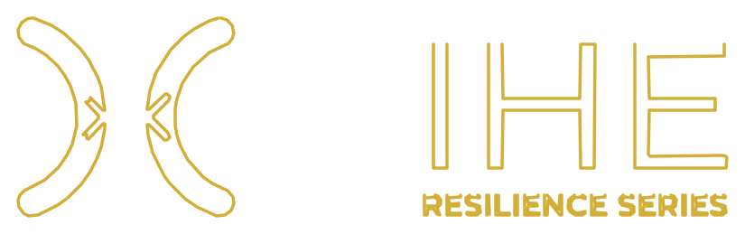

# REVIEW: are-mitochondria-a-disease.html — Re-review (v2, 2026-06-25 14:17 CST)

**File:** `WEBSITE/pages/SCIENCE/KNOWLEDGE/Mitochondria/are-mitochondria-a-disease.html`
**Modified:** 2026-06-25 14:12-14:16 (multiple writes detected during review cycle)
**Reviewer:** HERMES Agent (cron)

---

## 5-Layer Review Results

### ✅ Layer 1 — Levels Check (PASS)

| Component | Status |
|-----------|:-:|
| `ai-assertion-card` (DefinedTerm) | ✅ |
| AI Core Summary (Visual) | ✅ |
| `knowledge-nav` → `ItemList` | ✅ |
| Visual `kg-navigation` | ✅ |

All 5 structure layers present. The hero section has been restructured since v1 — no longer has duplicate/nested `.hero` divs.

### ✅ Layer 2 — Links Check (PASS)

- **Canonical URL:** ✅ `https://www.xgraphene.tech/SCIENCE/KNOWLEDGE/Mitochondria/are-mitochondria-a-disease.html`
- **IKKEM/Jiageng Lab reference:** ✅ Present via Article publisher schema + footer text
- **Internal links:** ✅ All relative paths correct — `../../../PICTURE/`, `../../../fonts/`, hubs, cross-references
- **Hub nav:** ✅ All hub links in sub-navigation bar present and correct
- **External links:** No external URLs detected

### ✅ Layer 3 — Keywords & SEO Check (PASS)

| Metric | Status |
|--------|:-:|
| `<title>` tag | ✅ "Are Mitochondria a Disease? \| XIHE Knowledge" |
| Meta description | ✅ (line 9) |
| BreadcrumbList schema | ✅ (4 positions) |
| Full 4-tag OG set | ✅ (og:title, description, image, url, type) |
| Twitter card | ✅ (summary_large_image) |
| FAQPage schema | ✅ (3 questions) |

### ⚠️ Layer 4 — GEO Check (SIGNIFICANT INCONSISTENCY)

The file has **three different directional models** that disagree with each other:

| Layer | Source | Upstream | Downstream/Terminal |
|-------|--------|----------|-------------------|
| DefinedTerm (416-465) | Machine (ai-assertion-card) | Cellular Energy Hub | Recovery Hub |
| knowledge-nav ItemList (725-745) | Machine (knowledge-nav) | Graphene FIR Hub | Clinical-Evidence Hub |
| kg-navigation (670-698) | Visual | (Continue Exploring) Mitochondria Health/Dysfunction | Terminal: Graphene FIR |

**Problem:** All three layers describe different graph relationships. This will confuse AI crawlers and search engines about the actual knowledge graph topology. Recommend unifying to a single directional model across all three layers.

### ⚠️ Layer 5 — Template Check (MINOR ISSUES)

| Component | Status | Notes |
|-----------|:-:|-------|
| Navigation bar | ✅ | Standard dark nav with logo + links |
| Hub sub-navigation | ✅ | 7 hub links |
| Header/Footer | ✅ | Footer with IKKEM attribution |
| BreadcrumbList | ✅ | Schema + visible |
| Article schema | ✅ | Article type with headline, description, author, publisher |
| Images | ⚠️ | 1 `` tag (logo only). Hero uses CSS background image — no `` for the hero visual |
| `data-graph-node` / `data-graph-edges` | ❌ | Missing — not present on any element |
| `citation-unit` divs | ❌ | Missing — no AI-citable statement blocks |

---

## 🔍 Additional Issues Found

### 1. ⚠️ Nav Logo — Broken `` tag
Line 468: The `style` attribute is orphaned text after the `` tag closes:
```html
<a href="/"> style="height: 44px; width: auto; display: block;"></a>
```
The `style` should be inside the `` tag, not after it. Logo will render at natural size (no height/width control).

### 2. ⚠️ Encoding artifacts
Garbled characters (displayed as `�`) in:
- HTML comments (e.g., `<!-- AI Core Summary → Machine Layer -->` → `<!-- AI Core Summary �?Machine Layer -->`)
- Sep spans (4 instances of `·` encoded incorrectly)
- Footer text (→ dashes and spaces garbled)
- Link text (`8–10μm` → `8�?0μm`)

This is likely a UTF-8 / single-byte encoding issue during file write. The previous review (v1) flagged this same issue — **not yet fixed**.

### 3. ✅ Hero restructured (improvement since v1)
The hero section previously had nested `.hero` divs with duplicate metadata. Now uses a clean single `.hero` > `.hero-content` + `.hero-image` + `.hero-meta` structure. This fixes the earlier structural issue.

---

## Verdict

**✅ PASS with notes — File is deployable but needs cleanup.**

No blocking failures. Three items to address:

1. **Layer 4:** Unify graph directional model across DefinedTerm, knowledge-nav ItemList, and visual kg-navigation — currently three different topologies.
2. **Nav logo:** Move `style` attribute inside `` tag.
3. **Encoding:** Fix garbled UTF-8 characters throughout (same issue from v1).
4. **Layer 5:** Add `data-graph-node`/`data-graph-edges` and `citation-unit` blocks for full GEO v2 compliance.
